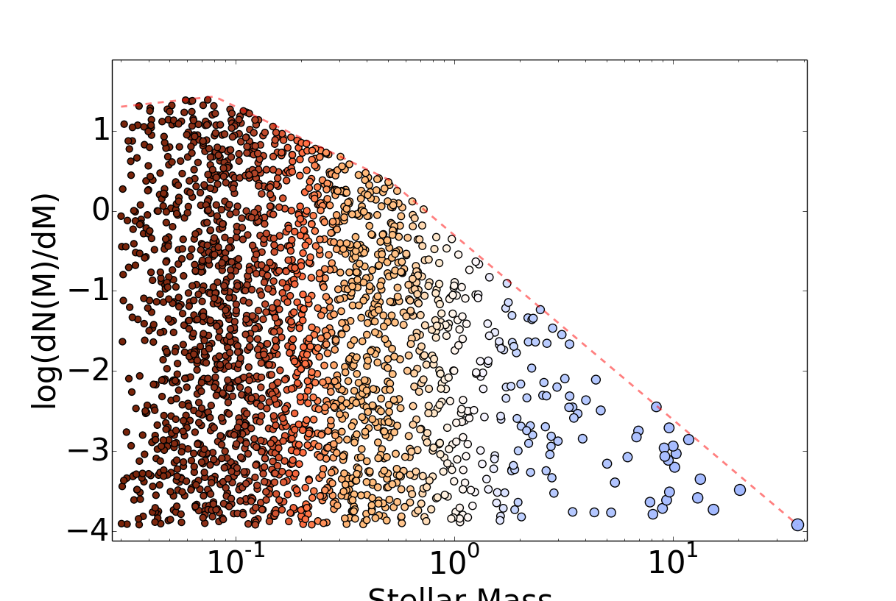

# IMF

Simple tools to work with the Initial Mass Function

Some basic examples below.

1. Make a simple 1000 Msun cluster sampled from the default Kroupa IMF:

    ```
    cluster = imf.make_cluster(1000)
    ```

   or from a Salpeter IMF::

    ```
    cluster = imf.make_cluster(1000, massfunc='salpeter')
    ```

2. Create a sample of clusters to do some analysis of later.  This will make clusters
   with masses Gaussian-distributed around a given mean mass in the list of
   cluster_masses, so that you could then do things like estimate the typical
   luminosity of a cluster for a given mass:

    ```python
   from imf import imf
   from astropy.utils.console import ProgressBar
   cluster_masses = [100, 1000, 10000]
   nclusters_per_bin = 30
   clusters = np.array([[imf.make_cluster(mass*(np.random.randn()/20.+1.), silent=True)
                         for ii in range(nclusters_per_bin)]
                         for mass in ProgressBar(cluster_masses)])
   ```

3. Calculate the mass fraction represented by M>8 Msun stars in a Kroupa IMF when
   the maximum mass is 200 Msun:

   ```python
     kroupa = imf.Kroupa()

     mmax = 200
     cutoff1 = 8

     over8fraction = (kroupa.m_integrate(cutoff1, mmax)[0] /
                      kroupa.m_integrate(kroupa.mmin, mmax)[0])
    ```

4. This figure was made with examples/imf_figure.py

    


## Credits

 * Adam Ginsburg (@keflavich, wrote most of this)
 * Sergey Koposov (@segasai, majorly refactored the distribution functions)
 * Tiffany Christian (@teachristian, made some small corrections)
 * Theo Richardson (@richardson-t, refactored optimal sampling)

No formal citation is available yet; please just reference the repository
(https://github.com/keflavich/imf) if you use this.
